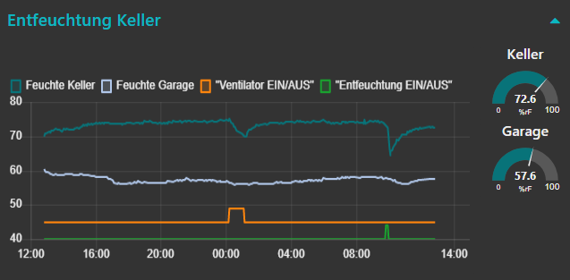
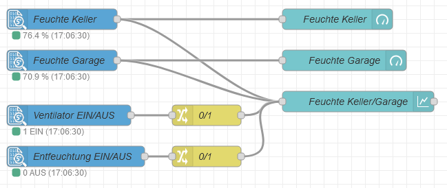
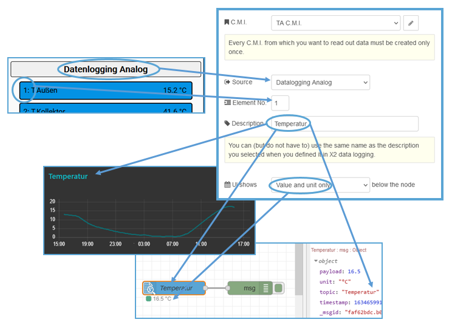

[](https://nodered.org)
[](https://www.npmjs.com/package/node-red-contrib-ta-cmi)
[](https://www.npmjs.com/package/node-red-contrib-ta-cmi)
[](https://github.com/peteraustria/node-red-contrib-ta-cmi/commits/master)
[](https://github.com/vivereSmartGroup/node-red-contrib-ta-cmi/master/LICENSE)
[](https://www.paypal.com/donate?business=RXENQEUPYFL2Y&no_recurring=1&currency_code=EUR)

# node-red-contrib-ta-cmi


The **C**ontrol and **M**onitoring **I**nterface (**C.M.I.**) is an interface for convenient system monitoring, remote control and data logging of all controllers with DL or CAN bus form [Technische Alternative RT GmbH, Austria]("https://www.ta.co.at/en/" "Webpage of Technische Alternative RT GmbH").

This node can be configured to query the [C.M.I.]("https://www.ta.co.at/en/x2-operation-interfaces/cmi/" "C.M.I. product page") at configurable intervals and provide any value at its output. So it is easy to access, display and visualize Data that is coming from e.g. the [UVR16x2 programmable universal controler]("https://www.ta.co.at/en/x2-freely-programmable-controllers/uvr16x2/" "UVR16x2 product page")> UVR16x2 programmable universal controler</a> with node-red.


## Quick Start

Install from your <b>Node-RED Manage Palette</b> or using npm:
```
npm install node-red-contrib-ta-cmi
```
## Example






```
[{"id":"d32cf45d.c9a4","type":"cmi in","z":"9bcb7893.92f808","cmi":"244863cc.935f84","name":"Feute Keller","item":"23","source":"0","timestamp":"0","x":150,"y":120,"wires":[["aae3b244.fd7a28","d1ffe25.0138b2"]]},{"id":"fcc86929.a56a38","type":"cmi in","z":"9bcb7893.92f808","cmi":"244863cc.935f84","name":"Feute Garage","item":"24","source":"0","timestamp":"0","x":150,"y":180,"wires":[["aae3b244.fd7a28","24ab1b9c.7347a4"]]},{"id":"47dea5ed.759ebc","type":"cmi in","z":"9bcb7893.92f808","cmi":"244863cc.935f84","name":"Ventilator EIN/AUS","item":"21","source":"1","timestamp":"0","x":170,"y":260,"wires":[["b57f6bfa.8cb098"]]},{"id":"2d98b677.847f9a","type":"cmi in","z":"9bcb7893.92f808","cmi":"244863cc.935f84","name":"Entfeuchtung EIN/AUS","item":"22","source":"1","timestamp":"0","x":180,"y":320,"wires":[["1a6a8eed.4f3099"]]},{"id":"aae3b244.fd7a28","type":"ui_chart","z":"9bcb7893.92f808","name":"Feuchte Keller/Garage","group":"88a17a33.f3f398","order":1,"width":"10","height":"6","label":"","chartType":"line","legend":"true","xformat":"HH:mm","interpolate":"linear","nodata":"","dot":false,"ymin":"40","ymax":"","removeOlder":"24","removeOlderPoints":"","removeOlderUnit":"3600","cutout":0,"useOneColor":false,"useUTC":false,"colors":["#097479","#aec7e8","#ff810f","#2ca02c","#98df8a","#d62728","#ff9896","#9467bd","#c5b0d5"],"outputs":1,"useDifferentColor":false,"x":570,"y":240,"wires":[[]]},{"id":"d1ffe25.0138b2","type":"ui_gauge","z":"9bcb7893.92f808","name":"Feuchte Keller","group":"88a17a33.f3f398","order":2,"width":"2","height":"2","gtype":"gage","title":"Keller","label":"%rF","format":"{{value}}","min":"0","max":"100","colors":["#ff0000","#097479","#ff0000"],"seg1":"50","seg2":"75","x":540,"y":120,"wires":[]},{"id":"24ab1b9c.7347a4","type":"ui_gauge","z":"9bcb7893.92f808","name":"Feuchte Garage","group":"88a17a33.f3f398","order":3,"width":"2","height":"2","gtype":"gage","title":"Garage","label":"%rF","format":"{{value}}","min":"0","max":"100","colors":["#ff0000","#097479","#ff0000"],"seg1":"50","seg2":"75","x":550,"y":180,"wires":[]},{"id":"b57f6bfa.8cb098","type":"change","z":"9bcb7893.92f808","name":"0/1","rules":[{"t":"change","p":"payload","pt":"msg","from":"true","fromt":"bool","to":"49","tot":"num"},{"t":"change","p":"payload","pt":"msg","from":"false","fromt":"bool","to":"45","tot":"num"},{"t":"set","p":"topic","pt":"msg","to":"\"Ventilator EIN/AUS\"","tot":"str"}],"action":"","property":"","from":"","to":"","reg":false,"x":350,"y":260,"wires":[["aae3b244.fd7a28"]]},{"id":"1a6a8eed.4f3099","type":"change","z":"9bcb7893.92f808","name":"0/1","rules":[{"t":"change","p":"payload","pt":"msg","from":"true","fromt":"bool","to":"44","tot":"num"},{"t":"change","p":"payload","pt":"msg","from":"false","fromt":"bool","to":"40","tot":"num"},{"t":"set","p":"topic","pt":"msg","to":"\"Entfeuchtung EIN/AUS\"","tot":"str"}],"action":"","property":"","from":"","to":"","reg":false,"x":350,"y":320,"wires":[["aae3b244.fd7a28"]]},{"id":"244863cc.935f84","type":"cmi config","description":"TA C.M.I.","ip":"192.168.1.8","interval":"1"},{"id":"88a17a33.f3f398","type":"ui_group","name":"Entfeuchtung Keller","tab":"18886b9.a624594","order":9,"disp":true,"width":"12","collapse":true},{"id":"18886b9.a624594","type":"ui_tab","name":"Keller / Garage","icon":"exposure_neg_1","order":3,"disabled":false,"hidden":false}]
```


## Configuration

### One-time Settings
In the "Edit cmi node" properties page klick the little pencil icon and node-red will show up the "Add new cmi config config node". Here you fill in the requested information as follow:


**Note:** For each C.M.I. in your network you have to do this only once.
When done, plase click the "Add" button and node-red will return you to the "Edit cmi in node".

### Settings for each node
You can place as many cmi-in nodes in your flows as you like. From the dropdown select the same C.M.I. for each node (e.g. "TA C.M.I.").



Since version 0.1.2 of the node, you can additionally configure that the node skips a number of duplicate values to reduce the amount of data. For analog data you can also configure a tolerance in percent within which a value is treated as identical despite a (small) deviation and is therefore not output.

## What else...

### Responsibility

This node was developed by me privately, in my spare time and it is expressly **NOT a product of Technische Alternative RT GmbH**, but my own, private development. The company Technische Alternative RT GmbH is therefore neither responsible for the function nor for the support of this node. The author provides the code for free on GitHub "as it is" and also assumes no liability for any inconvenience or damage that may 
result from its use. 

If you like this node and you want it to be supported and improved in future, you could buy me a drink to motivate me to continue adding new features in the future and to maintain the program.

[](https://www.paypal.com/donate?business=RXENQEUPYFL2Y&no_recurring=1&currency_code=EUR "Thank you!")

### BETA stage

The program development is currently in the test phase. The node has been extensively tested on my system, and it works with the hardware and configuration I am using. Currently, I do not have any information on how the node behaves in other environments. Please support me by reporting briefly about your experiences at <a href="https://github.com/PeterAustria/node-red-contrib-ta-cmi/issues">Issues on GitHub</a>.

## Changelog

### 0.1.0 Initial version 2021-10-22
### 0.1.1 Minor changes in documentation 2021-10-22
### 0.1.2 New features added, and bugs removed 2021-10-28
- **Feature added to skip duplicate values.** It is now possible not to output repetitive values ​​every time, but only after x repetitions of the same value, but immediately when the value is changed. This can be useful, for example, if you want to display the values ​​in a chart node. Because a very high number of values ​​in a chart node significantly reduces performance. If the value is an analog value, you can also set a tolerance in percent within which a value is treated as identical despite a (small) deviation and is therefore not output.
- **Corrected request time.** In the initial release the node requested data from the C.M.I. twice as often as configured.
- **removed 'part'** in the message object of digital logging data.
- **added up/down buttons** for numeric inputs.
### 0.1.3 Minor changes 2021-10-29
- Some **spelling mistakes** corrected in the dialogs and also in the help texts.
- For new nodes, the **default value for 'UI shows ... below the node'** set to **'Value and unit only'** as specified in the documentation.
- For new nodes, the **default value for 'Source'** is changed to **'Datalogging Analog'**; this setting is usually used more often.
- Revoved **"debug": "^4.3.1"** as a dependency for the node.

## FAQ

**After redeploying, the node desplays `too many requests to C.M.I. (max 1 per min allowed)`.**

>The C.M.I. allows a maximum of one query per minute. This is a requirement by Technische Alternative RT GmbH and not by the node.
>
>Through the redeploy, the node is restarted. It immediately tries to access the C.M.I. and read out the latest data. If the last access was not at least 60 seconds ago, this error message is displayed. After the period of time specified in the configuration (at least one minute later), the node again tries to read the data from the C.M.I. Latest now, this should work successfully. If not, please check whether the node is really only configured once. Even if you want to read out multiple values you must configure the C.M.I. only once (click the little pencil-icon only in the first node you add). If you re-use the node, just open the dropdown and select the already configured C.M.I. 

**The user credentials in the configuration of the node are correct, but the node still displays `wrong user or password`.**

>You **must** use the credentials of an **"expert"** user. A normal user or guest does not work. 
>
>This is a requirement by Technische Alternative RT GmbH and not by the node.

**I configured a polling intervall of 2 minutes in the configuration of the C.M.I. but the node(s) send(s) out data every 1 minute**

>This was a bug in the initial version and is corrected since version 0.1.2

## Bugs and feature requests

This node was developed in my spare time (when I should be sleeping). If you have any change requests or notice errors, please be patient with me; it may take a while, but I am happy to add extensions and eliminate errors. Please report any issues or enhancement requests at <a href="https://github.com/PeterAustria/node-red-contrib-ta-cmi/issues">GitHub</a>.